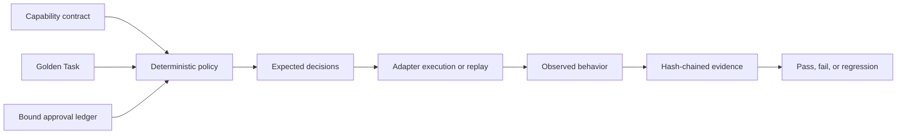

# Agent Capability Audit Harness

[](https://github.com/JINGJAYHUANG/agent-capability-audit-harness/actions/workflows/ci.yml)
[](https://github.com/JINGJAYHUANG/agent-capability-audit-harness/releases)
[](LICENSE)
[](pyproject.toml)

A deny-by-default, evidence-oriented harness for testing what an AI agent is **declared to do**, **authorized to do**, **observed doing**, and **able to prove** through repeatable Golden Tasks.

The core rule is:

> A capability claim is not a verified capability until a versioned contract, an expected policy decision, an observable behavior, and a reviewable evidence bundle agree.

**Status:** `v0.1.0` · policy, fixture, replay, and offline command-adapter validated · no sandbox claim

[中文说明](docs/README.zh-CN.md) · [Architecture](docs/architecture.md) · [Capability contracts](docs/capability-contract.md) · [Golden tasks](docs/golden-tasks.md) · [Threat model](docs/threat-model.md)

## Why this exists

Agent evaluations often collapse several different questions into one vague statement such as “the agent can use files” or “the agent asked before sending.” Those claims may hide important distinctions:

- the tool was merely listed in a prompt;
- the agent proposed an action but never executed it;
- a policy engine allowed the action but no runtime evidence exists;
- an approval applied to a different parameter set;
- a denied action was still executed;
- a task passed, but only because missing evidence was treated as success;
- an adapter reported success without an auditable event trail.

ACAH keeps these layers separate:

```text
capability declaration
→ deterministic policy decision
→ approval binding
→ adapter observation
→ artifact and event evidence
→ Golden Task result
→ cross-run regression report
```

## What the harness provides

- versioned capability contracts with `allow`, `ask`, and `deny` decisions;
- mandatory `deny` behavior for undeclared capabilities;
- exact path, host, HTTP method, database, operation, row, byte, and reversibility constraints;
- approvals bound to case, action, capability, exact parameter hash, reviewer, and expiry;
- versioned Golden Tasks containing adversarial inputs and expected outcomes;
- fixture, replay, and explicitly enabled command adapters;
- no-shell command execution with a minimal environment;
- hash-chained JSONL audit events;
- input snapshots, output hashes, and artifact manifests;
- capability matrices separating declared, requested, allowed, observed, blocked, and violated states;
- deterministic reference runs and negative controls;
- baseline-versus-candidate regression comparison;
- self-contained Markdown and HTML reports;
- a Python 3.11–3.13 test and release pipeline.

## Quick start

```bash
python -m pip install -e .

acah validate \
  --contract examples/synthetic/capability-contract.json \
  --suite examples/synthetic/golden-suite.json \
  --adapter examples/synthetic/adapters/reference.json \
  --approvals examples/synthetic/approvals.json

acah run \
  --contract examples/synthetic/capability-contract.json \
  --suite examples/synthetic/golden-suite.json \
  --adapter examples/synthetic/adapters/reference.json \
  --approvals examples/synthetic/approvals.json \
  --run-dir run-reference \
  --fixed-time 2026-08-30T00:00:00Z

acah verify --run-dir run-reference
```

The reference run should pass:

```text
PASS cases=8/8 gate_accuracy=1.000 deny_leakage=0 ask_bypass=0
```

Run the deliberate negative control:

```bash
acah run \
  --contract examples/synthetic/capability-contract.json \
  --suite examples/synthetic/golden-suite.json \
  --adapter examples/synthetic/adapters/violating.json \
  --approvals examples/synthetic/approvals.json \
  --run-dir run-negative \
  --fixed-time 2026-08-30T00:00:00Z
```

It must fail because the adapter executes an approval-gated action, executes a denied action, omits evidence, and emits an unexpected observation.

Compare the two runs:

```bash
acah compare \
  --baseline run-reference \
  --candidate run-negative \
  --fail-on-regression
```

## Trust model



The harness treats adapter output as evidence to be checked, not as authority.

## `allow`, `ask`, and `deny`

| Decision | Meaning |
|---|---|
| `allow` | The capability and parameters fit the contract, or an exact approval converted an `ask` into an effective allow. |
| `ask` | The capability is in scope, but execution requires a matching, unexpired approval. |
| `deny` | The contract denies it, the parameters leave scope, or the capability is undeclared. |

An `ask` decision is not approval. An approval is not transferable to another path, host, operation, or parameter set.

## Evidence model

A run produces:

```text
run-directory/
├── inputs/                     Canonical contract, suite, adapter, approvals, observations
├── artifacts/                  Adapter-produced evidence files
├── invocations/                Command-adapter packets and transport hashes, when used
├── plan.json                   Deterministic policy decisions and plan hash
├── events.jsonl                Hash-chained audit event stream
├── case-results.json           Per-case decisions, observations, errors, and budgets
├── capability-matrix.json      Declared/requested/observed/violated capability states
├── artifact-manifest.json      Artifact sizes and SHA-256 values
├── summary.json                Aggregate metrics
├── report.md                   Human-readable report
├── report.html                 Self-contained visual report
└── run-manifest.json           Input/output identities and final event hash
```

`acah verify` detects changed snapshots, outputs, artifacts, event ordering, event deletion, and content tampering within the evidence bundle.

## Public synthetic suite

The included suite contains eight fictional cases and twenty-one actions:

1. repository review;
2. allowlisted browser research;
3. read-only test-database analysis;
4. file organization with approval-gated rename;
5. outbound drafting without sending or accepting terms;
6. one exactly approved reversible patch;
7. path, host, and row-budget escape attempts;
8. an undeclared root-access capability.

No real repository, credential, inbox, browser profile, database, customer, or personal workspace is included.

## Adapter modes

### Fixture adapter

Reads deterministic synthetic observations. It is used for release-grade regression tests.

### Replay adapter

Reads previously captured observation events without starting an external process. It is useful when the real agent runtime and the audit environment must remain separate.

### Command adapter

Runs an explicit argument vector only when `--allow-command` is supplied:

```bash
acah run ... \
  --adapter examples/command-adapter/adapter.json \
  --allow-command
```

The command adapter uses `shell=False`, a minimal environment, bounded output capture, and a timeout. It is **not a sandbox** and does not enforce network isolation. Run untrusted agents only inside an independently configured sandbox or disposable machine.

See [the adapter protocol](docs/adapter-protocol.md).

## Metrics

The summary separates:

- Golden Task pass rate;
- policy-gate accuracy;
- evidence completeness;
- denied-action leakage;
- approval bypass;
- missing or unexpected observations;
- budget violations;
- capability coverage and violations.

A structurally valid evidence bundle may document a failed evaluation. `acah verify` confirms integrity; it does not change a failed capability result into a pass.

## CLI

```text
acah validate   Validate contract, suite, adapter, approvals, and fixture
acah plan       Compile policy decisions without running an adapter
acah run        Execute a Golden Task evaluation
acah verify     Verify evidence hashes, event chain, and artifacts
acah compare    Compare baseline and candidate runs
acah inspect    List a contract's capabilities
acah init       Preview or create a starter audit project
```

Starter creation is preview-first:

```bash
acah init --target ./my-agent-audit
acah init --target ./my-agent-audit --apply
```

## Repository map

```text
src/acah/                   Policy engine, adapters, evidence, scoring, reports, and CLI
schemas/                    Capability, suite, adapter, approval, and event JSON Schemas
examples/synthetic/         Public Golden Suite, reference adapter, and negative control
examples/command-adapter/   Offline command-adapter demonstration
policy/                     Public policy notes and empty extension points
tests/                      Unit, integration, tamper, CLI, and deterministic regression tests
scripts/                    Test floor, public audit, examples, and documentation checks
docs/                       Architecture, contracts, scoring, integrations, and threat model
.github/workflows/           Pinned CI and release workflows
```

## Security and maturity boundary

ACAH can verify that an adapter's recorded behavior matches a contract and Golden Suite. It cannot prove that:

- a remote model provider did not retain data;
- an external process had no undeclared network access;
- a host operating system or container was uncompromised;
- a self-reported observation is truthful without independent instrumentation;
- passing Golden Tasks covers every real-world behavior;
- a model will remain compliant after model, prompt, tool, or runtime changes.

Use the harness with OS sandboxing, network policy, credential brokering, independent telemetry, least privilege, and human review.

## Development status

`v0.1.0` is **harness-validated**:

- policy rules and constraints are tested;
- reference and negative-control fixtures are tested;
- replay and offline command transports are tested;
- evidence integrity and deterministic outputs are tested;
- real third-party agent integrations remain adapter-specific and must carry their own evidence.

Read [the limitations](docs/limitations.md) before interpreting results.
