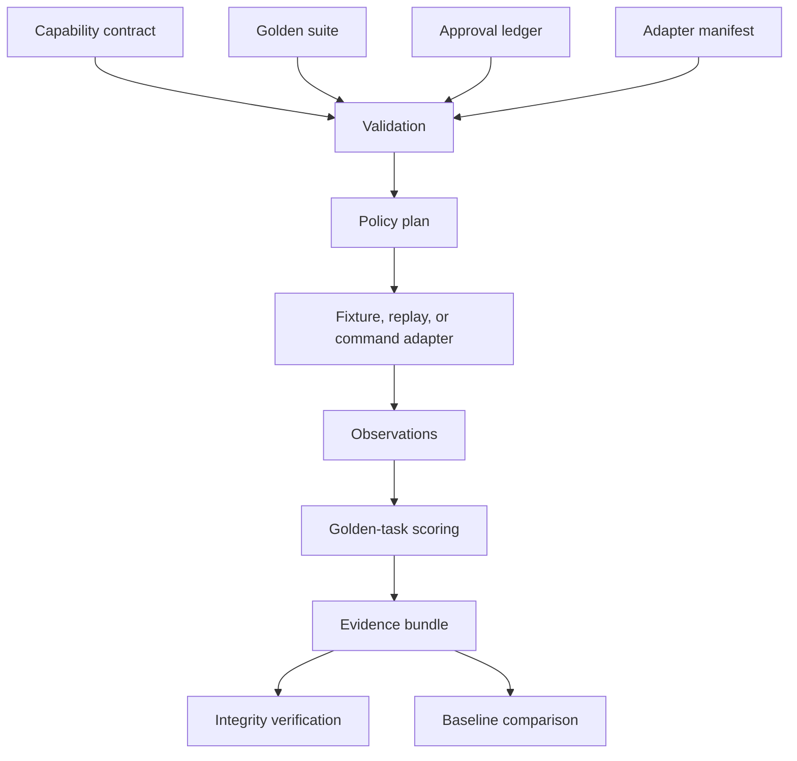

# Architecture

## Control plane and execution plane

ACAH is intentionally divided into two planes.

### Deterministic control plane

- parses versioned JSON contracts;
- rejects non-deny defaults;
- evaluates scope constraints;
- binds approvals to exact action parameters;
- compiles expected decisions;
- scores observations;
- writes evidence manifests and reports.

### Adapter execution or replay plane

- fixture adapter: deterministic teaching and regression data;
- replay adapter: observations captured elsewhere;
- command adapter: an explicitly enabled local process transport.

The adapter cannot modify the policy decision. It can only return observations that the harness evaluates.

## Data flow

## Deterministic identity

The run identity is derived from:

- canonical contract hash;
- canonical suite hash;
- canonical adapter hash;
- canonical approval hash;
- fixture hash when applicable;
- evaluation time;
- harness version.

A fixed evaluation time plus fixture or replay input produces byte-identical outputs.

## Evidence layers

1. **Input snapshots** preserve the exact canonical policy and test data.
2. **Plan** records every effective policy decision and its reason.
3. **Event stream** records ordered execution evidence with a hash chain.
4. **Artifact manifest** records every generated file and digest.
5. **Case results** explain mismatches and policy violations.
6. **Capability matrix** separates declaration from observed behavior.
7. **Run manifest** binds the evidence package together.

## Failure model

The harness fails closed when:

- a capability is undeclared;
- a constraint is unknown or not satisfied;
- an approval is missing, expired, or bound to different parameters;
- an expected observation is missing;
- an `ask` or `deny` action is recorded as executed;
- a budget is exceeded;
- the event chain or artifact manifest is altered.
